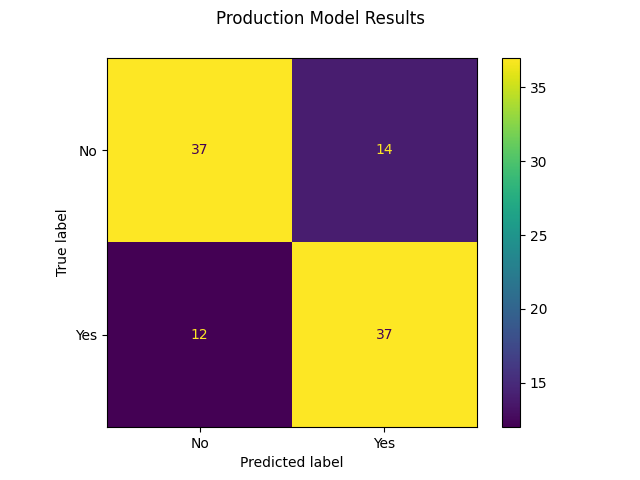

# Predicting Cardiovascular Disease

### Using Machine Learning to Predict Risk of Cardiovascular Disease based on Health Parameters

By: [Andreas Svensson]()  
Data used: [Kaggle Cardiovascular Disease](https://www.kaggle.com/datasets/sulianova/cardiovascular-disease-dataset)  
Models used: Logistic Regression, KNN, Random Forest (combined through Vote Classifier)  

 

# Model Results

 

# Engineered Features

### bmi_category

| BMI Feature | BMI | Category |
| --- | --- | --- |
| Moderate and Severe Thinness | less than 17 | 0 |
| Underweight | 17.0 - 18.4 | 1 |
| Normal Weight | 18.5 - 24.9 | 2 |
| Pre-obesity | 25,0 - 34.9 | 3 |
| Obesity Class I | 30.0 - 34.9 | 4 |
| Obesity Class II | 35.0 - 29.9 | 5 |
| Obesity Class III | 40 or above | 6 |

### bp_category

| Blood Pressure | Systolic | Diastolic | Category |
| --- | --- | --- | --- |
| Healthy | less than 120 | and less than 80 | 0 |
| Elevated | 120 - 129 | and less than 80 | 1 |
| Stage I | 130 - 139 | or 80 - 89 | 2 |
| Stage II | 140 or higher | or 90 or higher | 3 |
| Stage III | over 180 | or over 120 | 4 |  

*Note: stage describes stage of hypertension, where stage III is considered hypertension crisis*

 

# Takeaways

### Things I learned over the course of this project and could improve for next time

 

1. **File Structure**  

I used several notebooks to structure things more neatly, with one individual notebook for each separate model  

The problem with this execution was moving variables between notebooks as they need to be saved to file in between  

For the future, I would instead use python scripts for this part of the project, and only move the visuals into a notebook or even a markdown file for easy result evaluation while still keeping all variables in python files

 

2. **Gridsearch Function**

I created a function for performing grid search, with the idea to be able to iterate over multiple grid searches, tuning the parameters closer to the previous best one multiple times. The idea was that this would be able to find very close to optimal hyperparameters without having to grid search over as many different parameter combinations.

In reality however, at least for this case, the performance did not change much by tuning the hyperparameters more closely. The tradeoff in computational time vs the improved score was simply not worth it.

Thus, I ended up never iterating grid searches more than once.

 

3. **Visualizing Hyperparameters**

Something I didn't do in this project but in hindsight could definnitely be useful is to plot out hyperparameters. For example using an elbow plot for k in KNN could help to select a more impactful value for k with a good cost-score tradeoff.

